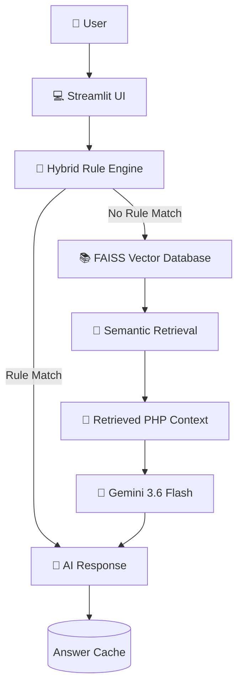

# 🚀 PHP RAG Assistant

AI-powered assistant...

## 🏗️ System Architecture

## ✨ Key Features

- 🔍 **Retrieval-Augmented Generation (RAG)** using FAISS vector search
- 🤖 **Gemini 3.6 Flash** integration for intelligent code understanding
- 🧠 **Hybrid Rule Engine** for instant responses to common project questions
- 📚 **Semantic Search** using Hugging Face embeddings
- ⚡ **Streamlit Web Interface** with an intuitive chat experience
- 💾 **Local Answer Cache** for faster repeated queries
- 📂 **Automatic PHP Project Indexing** and chunking
- 🔒 **Environment Variable Support** for secure API key management
- 📄 **PHP Code Generation** with downloadable output
- 🎯 **Production-Ready Modular Architecture**

- ## 🛠️ Technology Stack

| Category | Technology |
|-----------|------------|
| Programming Language | Python, PHP |
| LLM | Gemini 3.6 Flash |
| Vector Database | FAISS |
| Embeddings | BAAI/bge-base-en-v1.5 |
| Framework | LangChain |
| UI | Streamlit |
| Rule Engine | Custom Hybrid Rule Engine |
| Caching | Local JSON Cache |
| Version Control | Git & GitHub |

## 🔄 Project Workflow

1. User enters a question.
2. Hybrid Rule Engine checks for predefined rules.
3. If a rule matches, an instant answer is returned.
4. Otherwise, FAISS performs semantic retrieval.
5. Relevant PHP code chunks are retrieved.
6. Gemini 3.6 Flash generates the final response.
7. The answer is cached for future requests.

## 🚀 Future Enhancements

- Multi-turn conversational memory
- BM25 + FAISS hybrid retrieval
- Cross-encoder reranking
- Multi-language code support
- Docker deployment
- GitHub Actions CI/CD
- User authentication
- Retrieval quality evaluation
- Agentic AI workflow
- Cloud deployment

- ## 🌟 Project Highlights

- Built an AI-powered Retrieval-Augmented Generation (RAG) assistant for PHP projects.
- Uses Gemini 3.6 Flash to generate contextual responses from retrieved PHP code.
- Implements a Hybrid Rule Engine to provide instant answers for common project-related queries.
- Uses FAISS for efficient semantic vector search.
- Generates embeddings using Hugging Face's BAAI/bge-base-en-v1.5 model.
- Supports automatic PHP project indexing and chunking.
- Includes local answer caching to improve response times.
- Provides a clean Streamlit interface for interacting with the assistant.
- Designed with a modular architecture for easy extension and maintenance.

- ## 🧩 Architecture Components

| Component | Purpose |
|----------|---------|
| Streamlit | User Interface |
| Hybrid Rule Engine | Handles predefined queries instantly |
| FAISS | Semantic vector database |
| Hugging Face Embeddings | Converts PHP code into vector representations |
| Gemini 3.6 Flash | Generates intelligent responses |
| Local Cache | Reuses previous answers |

## 💼 Skills Demonstrated

- Retrieval-Augmented Generation (RAG)
- Large Language Models (LLMs)
- Prompt Engineering
- Vector Databases
- Semantic Search
- AI-assisted Code Understanding
- Streamlit Application Development
- Python Development
- PHP Code Analysis
- Git & GitHub
