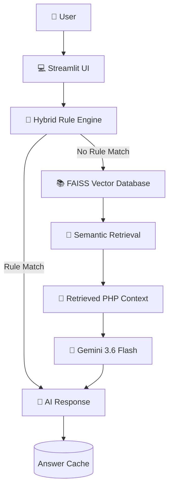

# 🚀 PHP RAG Assistant

AI-powered assistant...

## 🏗️ System Architecture

```mermaid
flowchart TD

A[👤 User]

B[💻 Streamlit UI]

C[🧠 Hybrid Rule Engine]

D[📚 FAISS Vector Database]

E[🔎 Semantic Retrieval]

F[📄 Retrieved PHP Context]

G[🤖 Gemini 3.6 Flash]

H[💬 AI Response]

I[(Answer Cache)]

A --> B
B --> C

C -->|Rule Match| H
C -->|No Rule Match| D

D --> E
E --> F
F --> G
G --> H

H --> I
```
